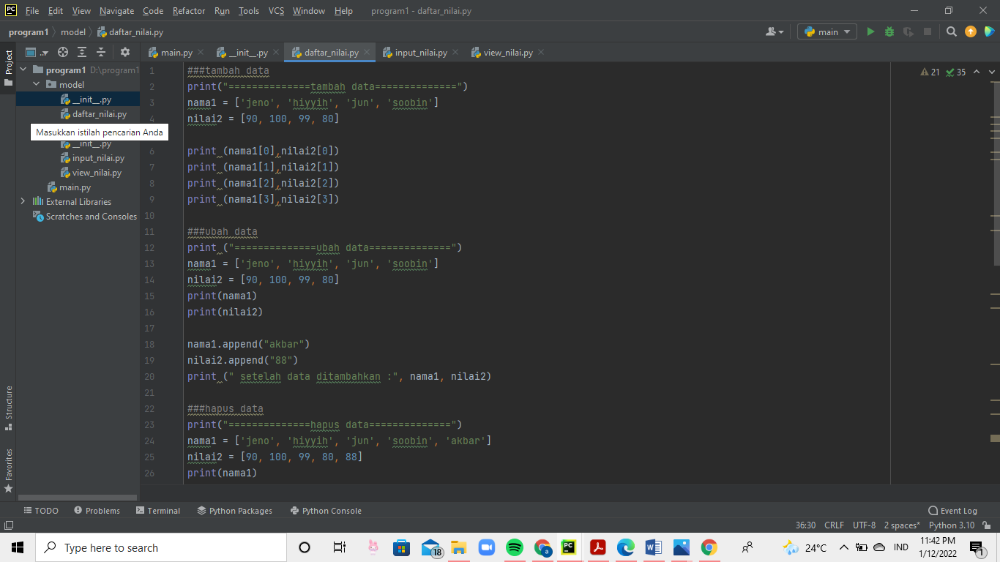
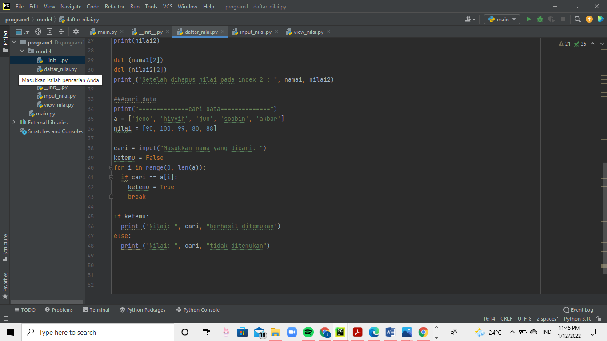
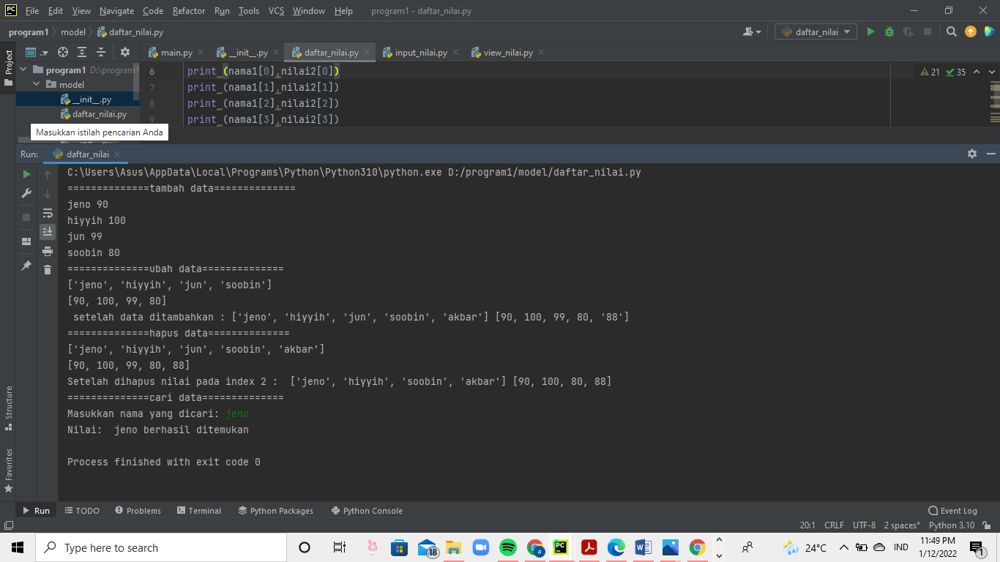
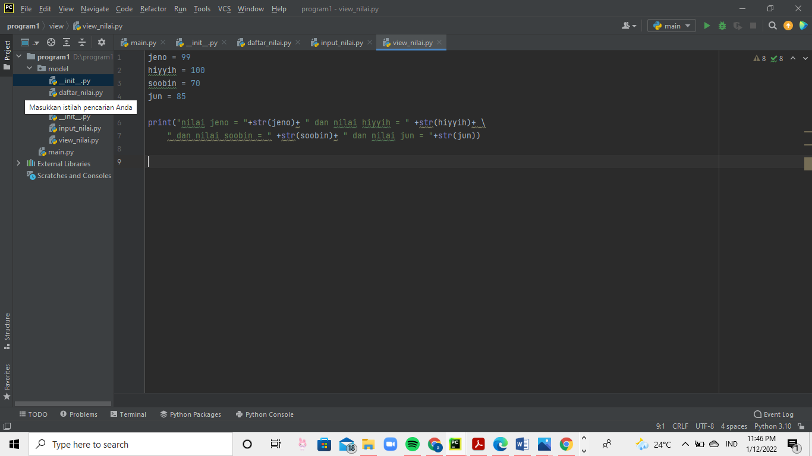
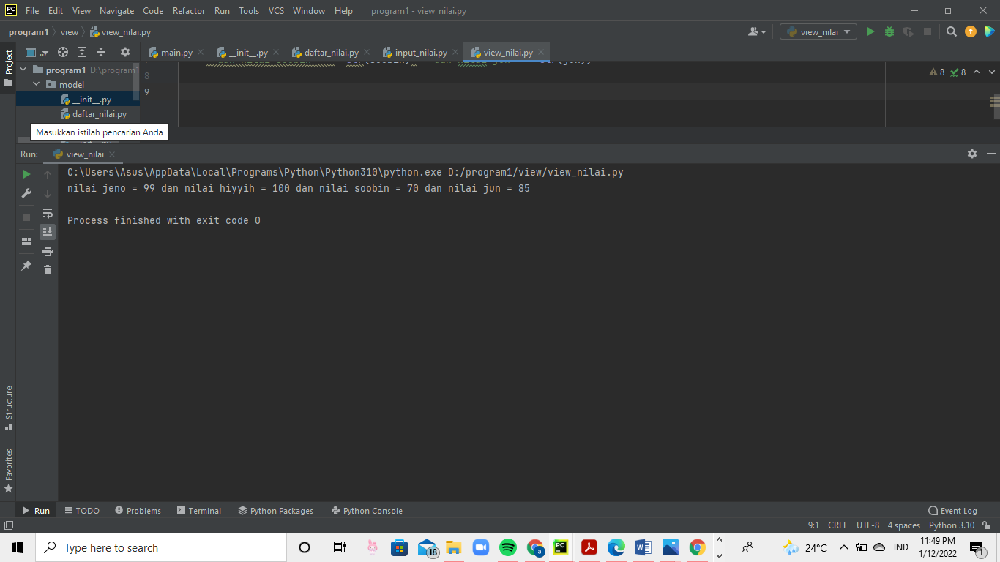
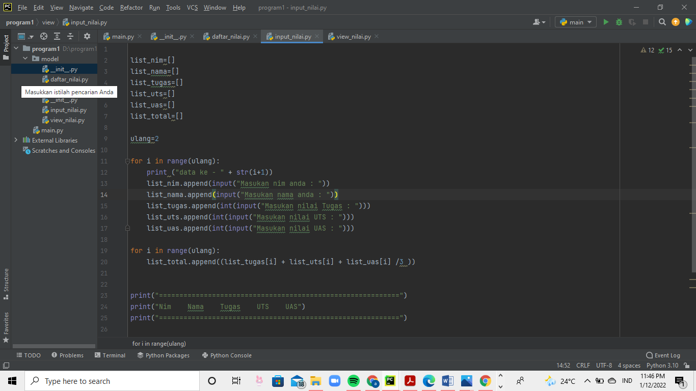
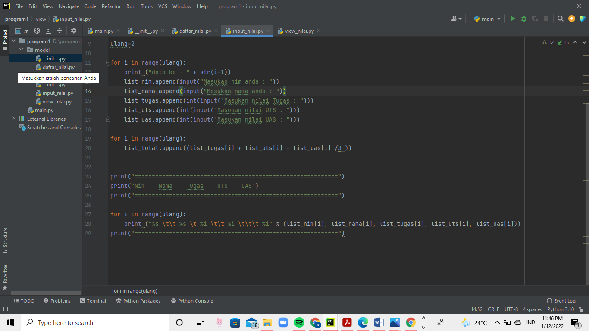
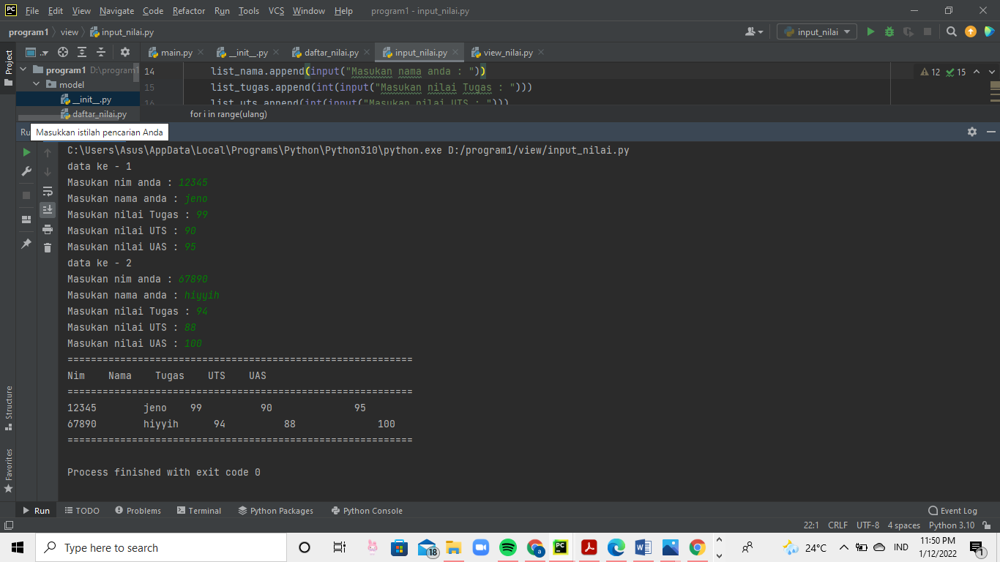

# uas

## DAFTAR NILAI 
### tambah data

Masukkan list yang anda mau 

lalu print(sesuai dengan nama list) 

contohnya seperti di gambar ini 

### ubah data 
disini saya menggunakan kode .append 

dan lalu hasilnya diprint 

### hapus data 
untuk hapus, sayan menggunakan kode del 

### cari data 
kemudian, untuk cari data saya menggunakan for if else sebagai kodenya 

untuk output daftar nilai, hasilnya seperti ini 

## VIEW NILAI 
untuk kode ini saya memakai kode str seperti dibawah ini 

hasil outputnya akan menjadi seperti ini 

## INPUT NILAI 
untuk ini, saya menggunakan list 

lalu ditambah for i in range 

outputnya akan menjadi seperti ini 

